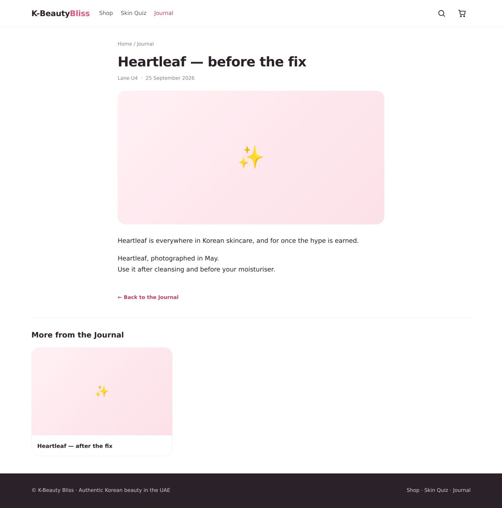
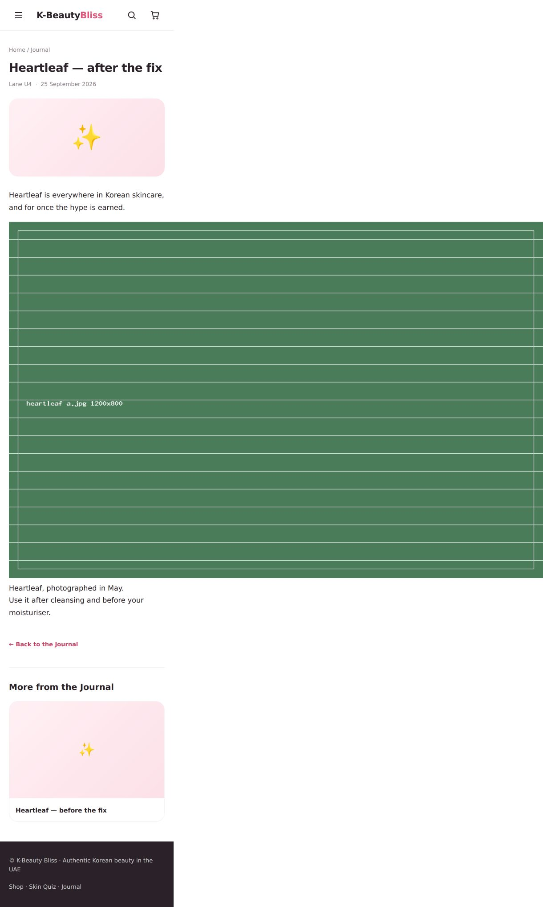
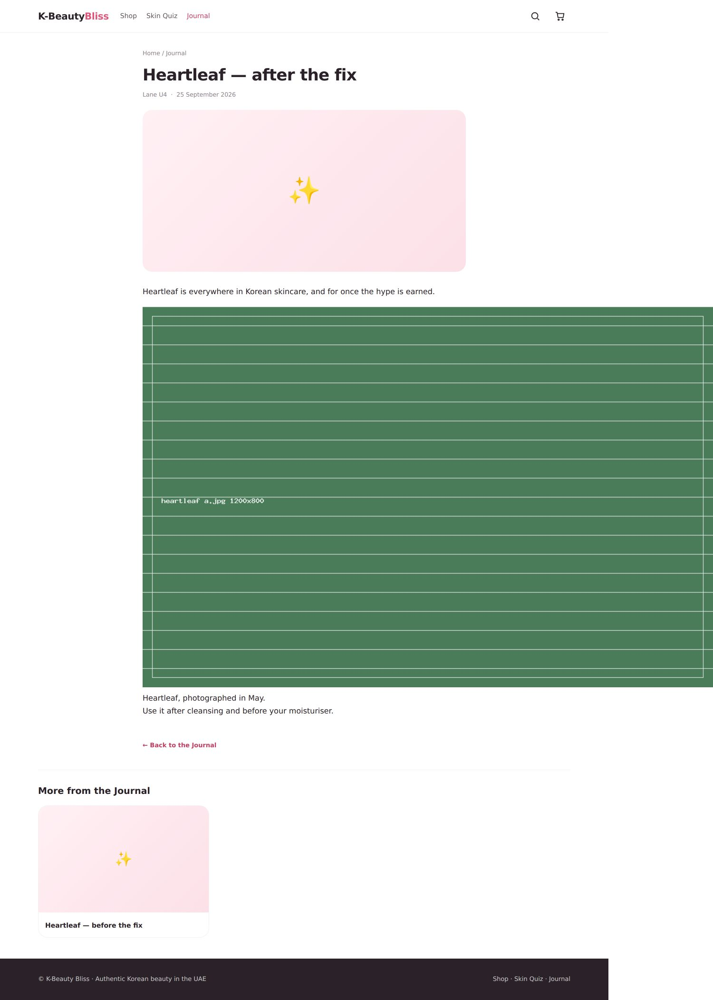
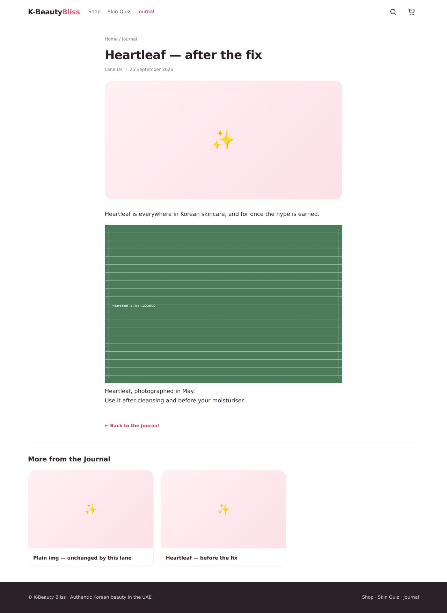

# Lane U4 — the photograph an imported article lost, and the two-step media window

Three things: a silent media loss on import (fixed), the `srcset` argument
re-checked against that fix (unchanged, tripwire updated), and the Phase 13 note
about fetching and re-pointing (**out of date** — the window is already closed).

---

## 1. `<picture>` arrived as nothing at all

### What the owner would have seen

An article imported from WordPress whose body carried a `<picture>` block
arrived on `/skincare-guide/…` with a hole where the photograph had been — and
if the block sat in a `<figure>`, the **caption survived without its picture**.
Nothing was reported. The import's own discard line said only that the
allowlist had removed some HTML, by length.

| | 390px | 1280px |
|---|---|---|
| Before |  |  |
| After |  |  |

Read the "before" shot at the caption: *"Heartleaf, photographed in May."* with
nothing above it. That is the whole defect in one line of copy.

### The mechanism, measured rather than quoted

`RichText::clean()` parses with `DOMDocument::loadHTML()` — libxml's HTML
parser, which is **HTML4**. Its void-element set is the HTML4 one: `area`,
`base`, `br`, `col`, `frame`, `hr`, `img`, `input`, `link`, `meta`, `param`. It
contains none of HTML5's additions.

So an unclosed `<source …>` is opened as a **container**, and everything after
it up to the close of its parent is parsed as its **child**. Measured on
libxml 2.9.14 / PHP 8.4.19:

```
<picture><source srcset=…></picture>
    =>  picture > source > img
```

`source` was in `RichText::DROP_WHOLE`, which removes the element **and its
subtree**. `<source>` before `` is the only valid ordering inside a
`<picture>`, so the `` was always inside that subtree.

Enumerating every tag on `DROP_WHOLE` against the parser gives exactly three
that are HTML5-void and therefore mis-read this way: **`source`, `track`,
`embed`**. (`wbr` and `keygen` are mis-read too but were on neither list, so
they already fell through to the unwrap path and lost nothing.) Every other
entry — `script`, `style`, `iframe`, `object`, `form`, `svg`, `audio`, `video`,
`template`, `noscript`, … — is a real container and `DROP_WHOLE` is right for
it.

### The fix, and why it is not a widened allowlist

Those three moved to a new third disposal, `RichText::DROP_TAG_KEEP_CHILDREN`:
the tag and **every attribute on it** are removed, and the children the parser
misfiled underneath it are promoted and then sanitised like any other node.

The argument is a structural one, not a taste one: **none of the three may
legally hold children**, so a child of one is never something the author put
inside it — it is the next sibling. Promoting it is what the document said.

- `ALLOWED` was **not** touched. `source`, `track`, `embed` and `picture` are
  still not allowed elements; none of them survives `clean()`.
- `srcset`, `type` and `src` on a `<source>` die with the tag, so nothing new
  reaches `posts.body`.
- The promoted children go through `walk()` **before** `unwrap()`, so a
  `<script>`, `<style>`, `<svg onload>`, `<iframe>` or `<form>` that the parser
  filed under a `<source>` is disposed of first. Pinned by
  *"it promotes nothing a sanitiser would not have let through anyway"*.

The alternative — pre-normalising the markup with a regex before it reaches the
parser — was rejected: it means pattern-matching untrusted HTML to decide what
the parser then sees, which is the denylist that file exists to refuse.

`DROP_TAG_KEEP_CHILDREN` is checked **before** `DROP_WHOLE` on purpose. Removing
the three names from `DROP_WHOLE` is what saves the pictures; the new branch is
the guard that stops the obvious future tidy-up ("`source` is a media tag, it
belongs on the drop list") from quietly restoring the loss. The mutation notes
in `tests/Feature/ImportJournalPictureTest.php` measure both halves, including
the mutation that did **not** go red.

### Both doors

`RichText::clean()` is the only door-keeper, and both writers to `posts.body`
call it:

- `PostImporter::cleanBodyReported()` — the method the previous round called
  `settleBody()`; that name does not exist in the file.
- `PostEditorApiController::save()` (`RICH_FIELDS = ['body']`), for both the
  English and the Arabic half.

`TranslationStore` and `TranslationInput` call it too, so the translated body
gets the same fix for free.

**Idempotency**: `clean(clean(x)) === clean(x)` for a `<picture>` body, and a
second `kbb:import` run over the same CSV leaves the column byte-identical. Both
pinned.

### How many real articles this affects

**Unknown, and not estimated.** The real kbeautybliss.com export is not in this
repo. Both tracked fixtures — `tests/Fixtures/woo/posts.csv` and
`tests/Fixtures/kbb-export/posts.csv` — contain zero `<picture>`, `<source>` and
`srcset`. One thing does bound it: the exporter
(`wordpress-plugin/kbb-exporter/…/class-kbb-export-stage-posts.php`) selects
`post_content` raw and applies no filters, so anything a plugin adds at *render*
time (WebP Express, Jetpack, `wp_filter_content_tags`) never reaches the CSV.
The exposure is confined to `<picture>` literally stored in the post — a page
builder, a block plugin, or hand-pasted HTML. Run the import and read the
discard lines to get the real number.

---

## 2. `srcset` — the argument re-checked end to end

`DocumentMediaRewrite::TAGS` still parses `img/src` and `a/href` only, and still
does not parse `srcset`. The premise that makes that safe — *the attribute
cannot reach `posts.body`* — is **unchanged** by this lane's fix, because
`ALLOWED` was not touched and `<source>` still does not survive.

What did change is the shape of the result, so the tripwire was updated rather
than left with a premise this lane had moved:
`ImportJournalSrcsetTest`'s third case used to *pin the defect* — it asserted
`sources()` returned `[]` for a `<picture>`. It now asserts the photograph's
`src` comes back and the `srcset` does not. That is strictly one more address
the rewrite and the audit can see, and zero more they are blind to.

---

## 3. Phase 13: "Fetching does not re-point the rows" — **no longer true**

The plan still carries:

> ▲ Fetching does not re-point the rows. Two steps, and between them the picture
> is on disk while the product still names the old host. The old site must not be
> switched off between them.

`MediaSideloader::repoint()` closes it. After a fetch batch lands its files, the
**same request** re-points the rows that named them, before it answers:

- `app/Services/Import/MediaSideloader.php` — `runBatch()` collects `$landed`
  and calls `$this->repoint($landed)` *before* `plan()`, so the plan in the
  response describes the shop as it is when the response is written.
- `repoint()` filters `MediaRewrite::propose()` and
  `DocumentMediaRewrite::propose()` down to **only the addresses this batch
  wrote**, deliberately: re-pointing files that arrived by FTP months ago would
  be the Fetch button doing something nobody asked it for.
- Both shapes are covered — cells (`products.image`, `posts.cover`) through
  `MediaRewrite`, and `` inside `posts.body` through
  `DocumentMediaRewrite`.
- `MigrationProgress` already says so on the screen: *"Fetching a picture now
  re-points the rows that named it, in the same step, so this number falls as
  the fetch runs."*
- `tests/Feature/ImportRepointsWhatItFetchesTest.php` pins it.

**What is genuinely left, and it is not a window.** Two rewriters skip anything
whose decision is not `REWRITE`: `MediaRewrite::apply()` at its `decision !==
self::REWRITE` guard and `DocumentMediaRewrite::groupByRow()` at the same test.
The decision itself is `is_file(public_path($relative))`, recomputed inside the
same request that applies. So an address whose file is not on disk is **never**
re-pointed — there is no moment at which a row names a file that is not there.

The manual **Store → Import → Addresses & pictures → apply** still exists and
still does the rest: files that arrived some other way (an FTP copy of
`wp-content/uploads`), and references whose fetch failed and were later fixed by
hand. Those, and only those, are why the old host should stay reachable until
that button has been pressed and the audit reads remote = 0.

**Proposal: correct the plan bullet, build nothing.** Suggested replacement for
the integrator, who owns `KBB-Master-Plan.md`:

> ✔ **Fetching re-points as it goes.** `MediaSideloader::repoint()` re-points
> the rows and the article bodies for the addresses each batch landed, in the
> same request. Nothing is ever re-pointed at a file that is not on disk. What
> still needs **Store → Import → Addresses & pictures → apply** is what the
> fetch did not land: pictures copied across by FTP, and references that failed
> and were fixed by hand. Keep the old host reachable until the audit reads
> remote = 0.

---

## Found, not fixed: an article body's `` overflows the page

Not this lane's change, and not this lane's file.

`resources/views/store/post.blade.php` styles the article body as `.abody` and
has **no `img` rule**, so any `` in a body renders at its intrinsic width.
Measured on the same page:

| page | viewport | `document.documentElement.scrollWidth` |
|---|---|---|
| `picture-after` (this fix) | 390 | **1220** |
| `picture-after` (this fix) | 1280 | **1500** |
| `plain-img` — a bare ``, byte-identical through `clean()` before and after this lane | 390 | **1220** |
| `plain-img` | 1280 | **1500** |

The third row is the control: a plain WordPress `` is untouched by this
lane (`clean()` is a no-op on it, asserted), and it overflows by exactly the
same amount. The defect predates this fix; restoring the photograph makes it
reachable for `<picture>` articles too.

One line of CSS in `.abody` closes it completely — measured by injecting the
rule at render time and re-reading the numbers:

```css
.abody img{max-width:100%;height:auto}
```

| page | viewport | scrollWidth | image box |
|---|---|---|---|
| `picture-after` + the rule | 390 | **390** | 350×233 |
| `picture-after` + the rule | 1280 | **1280** | 680×453 |




`resources/views/store/post.blade.php` is not in this lane's ownership, so it is
reported rather than edited. It is CSS only — no scripted measurement.
